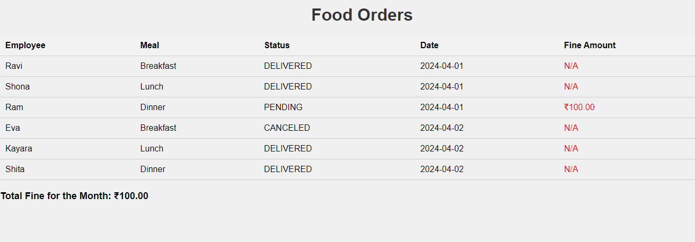

# TasteRide

TasteRide is a project that manages food orders for employees. It utilizes FastAPI for the backend API and provides a static HTML page for displaying food order details.

## Project Structure

TasteRide/
├── api/
│ ├── init.py
│ ├── app.py # FastAPI application object
│ ├── routers/ # Directory for router modules
│ │ └── food.py # Router module for food orders
│ └── models/ # Directory for Pydantic models
│ └── food.py # Pydantic model for food orders
├── static/
│ └── index.html # Static HTML page for displaying food orders
├── requirements.txt # Dependencies for the project
└── README.md # Project documentation

## Features

- **FastAPI Backend**: Utilizes FastAPI to provide a RESTful API for managing food orders.
- **Static HTML Page**: Displays food order details and calculates fines for pending orders.
- **Modular Structure**: Organized into separate directories for routers, models, and static files.

